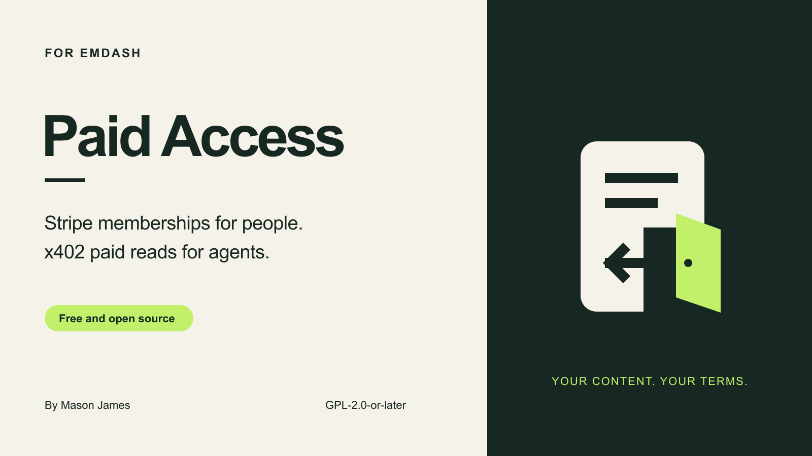

<!--
Copyright 2026 Stranger Studios.
Modified by Mason James, 2026-09-23 and 2026-10-09.
SPDX-License-Identifier: GPL-2.0-or-later
-->

# Paid Access for EmDash

[](https://github.com/masonjames/emdash-paid-access/actions/workflows/release-check.yml)
[](https://www.npmjs.com/package/emdash-paid-access)
[](https://github.com/emdash-cms/emdash)
[](LICENSE)

**Stripe memberships for people. x402 paid reads for AI agents.**
Use either module or both, with one set of content rules in EmDash.



[Get started](docs/guides/installation.md) · [Documentation](docs/README.md) ·
[Changelog](CHANGELOG.md) · [Support](SUPPORT.md) ·
[Report a security issue](SECURITY.md)

## What it does

- **Members:** Stripe plans, Checkout, a billing portal, and email magic-link sign-in.
- **Agents:** individual Markdown reads paid through x402, with receipts and separate
  testnet/mainnet totals.
- **Publishers:** entry and taxonomy rules, an editor panel, and server-rendered paywalls.
- **Existing sites:** delegated member access while Restrict With Stripe stays installed.

The complete plugin is **free under GPL**, without license keys or paid feature
tiers. Payments go to the creator's Stripe account or wallet; Paid Access takes
**no cut**. Provider fees may apply. Setup, migration, hosting, and support are
separate [services from Mason James](https://masonjames.com/plugins/paid-access/).

## Beta status

`0.1.0-beta.1` is the first public npm beta. **The EmDash plugin directory
remains unpublished.** The [installation guide](docs/guides/installation.md)
covers npm installation and building from the public source.

Try the [protected demo post](https://masonjames.com/blog/paid-access-demo/):
people use the site's existing Stripe memberships; agents pay $0.001 in
**Base Sepolia test USDC**. This demonstrates testnet settlement, not mainnet
revenue. See the [release verification](docs/releases/0.1.0-beta.1.md) for the
tested paths and remaining limits.

The beta targets **Node 22.12+**, **EmDash 1.2**, **x402 1.2**, and
**Astro `^6.1.3 || ^7.3.5`**. Both payment modules start off. Local tests and
package checks are distinct from a verified installation or payment on your host.
See [testing and release evidence](docs/guides/testing-and-releases.md).

The agent rail is **origin x402**. Gateway verification, subscriber agent tokens,
passes, free-member entitlements, automatic migration, and checkout trial
configuration are outside this beta. Cloudflare/Workers and registry-installed
core plus companion require their own host acceptance testing.

## Quick start

Start with an existing server-rendered EmDash 1.2 site on Node **22.12+**.
Install the exact beta and its x402 peer:

```sh
pnpm add emdash-paid-access@0.1.0-beta.1 @emdash-cms/x402@1.2.0
```

The [source-build instructions](docs/guides/installation.md#build-from-source)
require Node **22.18+**. An npm install supplies both the core descriptor
and Astro companion; it does not depend on an EmDash directory listing.

Add the descriptor and companion to your existing Astro configuration:

```js
import paidAccessPlugin from "emdash-paid-access";
import { paidAccessAstro } from "emdash-paid-access/astro";

// Inside defineConfig, preserving your existing adapter and EmDash options:
integrations: [
  paidAccessAstro({ collections: ["posts"] }),
  emdash({ /* database, storage, other plugins… */ plugins: [paidAccessPlugin] }),
],
```

Replace direct rendering of the protected post body with:

```astro
---
import PaidContent from "emdash-paid-access/components/PaidContent.astro";
// `post` is the EmDash entry already loaded by your page.
---
<PaidContent entry={post} collection="posts" />
```

Then open **Paid Access Settings** and configure [Stripe memberships](docs/guides/stripe-memberships.md)
or [testnet agent reads](docs/guides/x402-payments.md). Add a rule to a published
test entry. The [installation guide](docs/guides/installation.md) supplies the
full config, type setup, and first verification steps.

**The theme integration is required.** The registry core alone cannot gate public
content. Protect every other copy of the body—feeds, APIs, search, alternate
routes, and caches—using the [hosting checklist](docs/guides/hosting-and-caching.md).

## Choose a policy

| Policy | People | Agents |
| --- | --- | --- |
| `public` | Full content | Free Markdown when explicitly offered |
| `agents-pay` | Full content | Pay per read |
| `members` | Configured Stripe entitlement | Pay per read |
| `members-only` | Configured Stripe entitlement | Not for sale |

`agents-pay` leaves the HTML public. Members-only posts cannot be unlocked by an
agent token in this beta. [Policy precedence and exceptions →](docs/reference/access-policies.md)

## Documentation

| I want to… | Read |
| --- | --- |
| Install and protect my first post | [Installation](docs/guides/installation.md) |
| Sell memberships | [Stripe setup](docs/guides/stripe-memberships.md) |
| Offer paid Markdown | [x402 setup and receipts](docs/guides/x402-payments.md) |
| Configure components, paths, or account handlers | [Configuration reference](docs/reference/configuration.md) |
| Understand the security boundary | [Architecture and security](docs/reference/architecture-and-security.md) |
| Gate elements or pages in a visual builder | [Visual builders](docs/guides/visual-builders.md) |
| Migrate an existing membership site | [Coexistence and migration](docs/guides/migration.md) |
| Diagnose a failed request | [Troubleshooting](docs/reference/troubleshooting.md) |
| Contribute or prepare a release | [Testing and releases](docs/guides/testing-and-releases.md) |

## License and credits

[GPL-2.0-or-later](LICENSE). Based on
[Restrict With Stripe for EmDash by Stranger Studios](https://github.com/strangerstudios/emdash-restrict-with-stripe),
with original history and authorship retained. See [NOTICE.md](NOTICE.md).

Maintained by [Mason James](https://masonjames.com).
[Contributions](CONTRIBUTING.md) and [bug reports](https://github.com/masonjames/emdash-paid-access/issues)
are welcome. Send security reports [privately](SECURITY.md).
