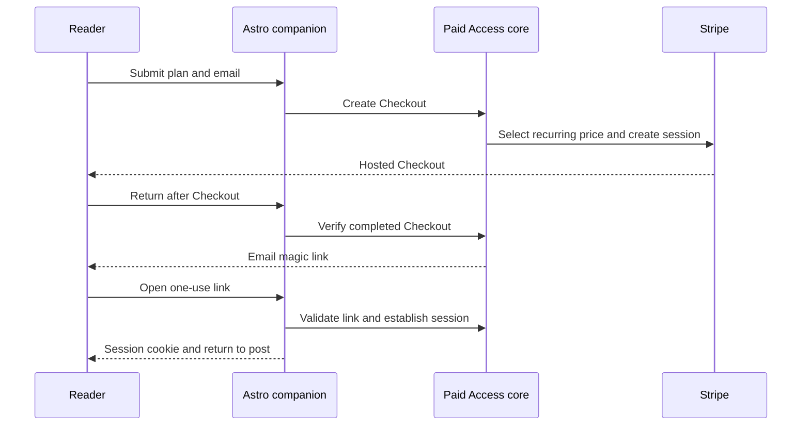

# Stripe memberships

[Documentation](../README.md) / Stripe

Use this after [installing the companion and protecting the theme body](installation.md).
You need your own Stripe account and an EmDash email provider. Memberships are
reader identities stored by the plugin; they do not create EmDash staff users.

## Configure a test plan

1. Configure and test the site's EmDash email provider. Sign-in and Checkout
   completion depend on email delivery.
2. In Stripe test mode, create a product with an active recurring monthly and/or
   yearly price. Use one intended active price per product and interval.
3. In **Paid Access Settings → Members**, choose **Stripe memberships** and enter
   the test secret key in the secret field. Match the key's test/live environment
   to the products and prices you use. Do not put keys in source or public config.
4. Add a plan with a stable plan ID, name, Stripe product, and monthly/yearly
   display labels. A nonempty label makes that interval's button visible.
5. Configure the Stripe customer portal. Set the site's canonical URL correctly
   so sign-in links and Checkout callbacks return to the intended host.
6. Give a published test entry a `members` or `members-only` rule and select the plan.

Example plan configuration, using a synthetic product ID:

| Field | Example | Meaning |
| --- | --- | --- |
| Plan ID | `supporter` | Stable identifier used by rules |
| Name | `Supporter` | Public plan name |
| Stripe product | `prod_YOUR_TEST_PRODUCT` | Product whose entitlement grants access |
| Monthly label | `$5/month` | Display copy; not the amount charged |
| Yearly label | `$50/year` | Display copy; not the amount charged |

Checkout selects an active recurring price on that product with a one-month or
one-year interval. **Stripe's price determines the charge.** The plugin does not
let you select a specific price ID or currency in the plan editor. Multiple
eligible prices are ambiguous; keep one intended price per interval for this beta.
The optional trial label does not create a trial or change Checkout parameters.

## Sign-in and billing flow

Magic links expire after 15 minutes. The `phb_session` cookie lasts up to 30 days
and is HTTP-only, SameSite=Lax, and Secure outside supported local HTTP hosts.
The plugin stores token hashes. Signing in proves identity; it does not itself
grant a free-member entitlement.

Use the default paywall or [Pricing component](../reference/configuration.md#components)
for Checkout/sign-in. The injected routes are handlers, not an account dashboard.
A signed-in member can visit `/account/portal` to manage billing. Sign-out is a
POST form to `/account/logout`.

## What grants access

For a restricted entry, the plugin resolves its configured plan/product IDs and
checks Stripe for a matching product. Current behavior grants access through:

- An **active or trialing subscription** containing a matching product.
- A **paid standalone invoice** containing a matching product, where the invoice
  has no subscription and has no truthy `phbIgnore` metadata value.

The invoice behavior is inherited from the membership implementation. Such a
purchase does not expire with a subscription. Account for it when testing
cancellation and when choosing which products should grant ongoing access.
Multiple selected product entitlements are alternatives: any matching product
can satisfy the combined Paid Access requirement. See [policy semantics](../reference/access-policies.md).

Entitlement checks call Stripe during restricted reads; no webhook endpoint needs
to be configured for this beta. A provider or access-check failure denies access.
An active session with no configured product does not unlock a members rule.

## Verify before inviting members

Use test data to exercise new Checkout, completion email, sign-in, expired/reused
links, sign-out, portal, a matching entitlement, and a nonmatching entitlement.
Test cancellation and expiration against the actual product types you use,
including any paid standalone invoices. Check both a fresh private browser and
the previously entitled browser after the entitlement changes.

If Restrict With Stripe is already installed, use [delegation](migration.md) first.
Do not enable two independent membership checkouts on the same content.

[Troubleshoot member access](../reference/troubleshooting.md#members-and-checkout)
