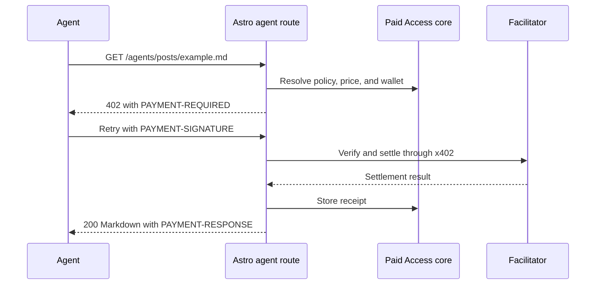

# x402 paid reads

[Documentation](../README.md) / x402

The beta sells individual Markdown reads through **origin x402**. A buyer pays
USDC to the site's configured wallet. Stripe and an email provider are not needed
for an agents-only setup.

## Configure Base Sepolia first

Keep the companion's default facilitator:

```js
paidAccessAstro({
  collections: ["posts"],
  facilitatorUrl: "https://x402.org/facilitator",
});
```

In **Paid Access Settings → AI agents**:

1. Turn on agents paying per read.
2. Select **Base Sepolia (test USDC)**, network `eip155:84532`.
3. Enter a test payout wallet address you control. Only the public EVM address
   belongs here, never a private key.
4. Keep the Advanced payment rail at **This site**, `origin-x402`.
5. Add an `agents-pay` or `members` rule to a published test entry and set a
   positive per-read price, for example `$0.001` of test USDC.

Prices support up to six decimal places. The admin accepts prices with or
without `$`; stored prices carry it. When multiple priced rules match, the
highest price applies. `members-only` takes precedence and is not for sale.

Leave **Offer free Markdown for posts without a rule** off until every affected
collection is safe to expose. An explicit public rule can offer free Markdown,
except while legacy membership delegation/presence prevents free agent reads.

## Request flow



To inspect an unpaid challenge, replace the example URL with your test host:

```sh
curl -i https://example.test/agents/posts/example.md
```

The expected result for a configured paid entry is 402 with payment requirements
and no protected body. `HEAD` deliberately removes payment headers before
enforcement so it cannot settle a payment for a response with no body.

For a real **testnet** purchase, the source repository provides a helper. Load
`PHB_TEST_PRIVATE_KEY` into the local process environment securely first; do not
paste it into a shell command, issue, fixture, or log.

```sh
node scripts/paid-read.mjs https://example.test/agents/posts/example.md
```

The helper registers only Base Sepolia, so it will not accept a mainnet challenge.
It prints the returned content; use synthetic test posts. The automated live
settlement test has a separate [explicit opt-in](testing-and-releases.md#live-payment-testing).

## Discovery and receipts

`GET /agents/offers.json` returns `{ items, nextCursor }`. Content items include
absolute purchase URLs; taxonomy items describe term-level pricing and do not
necessarily include an individual content URL. Follow `nextCursor` by passing
it back as `cursor`; optional `limit` is clamped to 1–100. Offers are cached for
five minutes and contain discovery data, never the paid body.

**Paid Access Receipts** separates Base mainnet from Base Sepolia. Overview
revenue excludes testnet USDC. A receipt records entry, payer, amount, network,
transaction, and timestamp. Compare it with the facilitator/chain result when
reconciling a payment. These totals are recorded gross receipts, not net income
or an accounting system. If settlement succeeds but receipt storage fails, the
content is still returned and an error is logged; investigate missing receipts.

Successful Markdown responses are private/no-store and include
`Content-Signal: ai-train=no, search=yes, ai-input=yes`. This is a declared
content-use signal, not a technical enforcement mechanism.

## Mainnet is a separate configuration

Base is `eip155:8453`. The beta refuses a paid Base read with the known default
test facilitator. Select an endpoint that supports Base and works with the
companion before enabling production sales, then rebuild the site.

`facilitatorUrl` must use HTTPS with no credentials, query string, or fragment.
The beta accepts a URL only, **not custom authentication headers**. If your
facilitator requires those headers, it needs a separately implemented server
integration. Changing Network in admin does not change this build-time endpoint.

Gateway verification, agent tokens, and passes are not available. Prove a
testnet purchase, invalid-payment denial, receipt matching, and
[paid-then-unpaid cache isolation](hosting-and-caching.md) before a mainnet canary.

[HTTP behavior](../reference/access-policies.md#agent-http-responses) ·
[Troubleshooting](../reference/troubleshooting.md#agent-requests)
