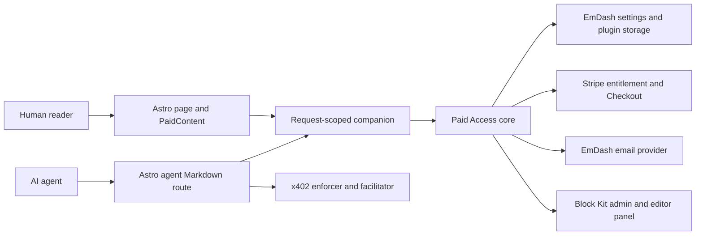

# Architecture and security

[Documentation](../README.md) / Architecture

Paid Access has two cooperating parts. The EmDash core owns rules, settings,
member records, and receipts. The Astro companion owns the public request/response
boundaries that need cookies, x402 headers, and server-side theme rendering.

## Why the companion is required

The standard-format core can be loaded on Node or packaged for the sandbox.
The public flow still needs the companion to read the member cookie, pass an
explicit session token to the core, set payment response headers, and render
or omit the protected body. A registry-only installation cannot do those jobs.

Node's descriptor installation runs through the host's plugin runtime; do not
mistake the standard package format for proof of sandbox isolation on every
installation. The [sandbox tests](../guides/testing-and-releases.md) exercise the
core independently of a complete deployed site.

## Trust boundaries

| Boundary | Responsibility |
| --- | --- |
| Theme | Render only after access is granted; protect APIs/feeds/search/other copies |
| Companion | Read cookie server-side, validate route/redirect inputs, serve agent body after settlement |
| Core | Validate rules/settings, resolve entitlements, use plugin-owned storage |
| Host runtime | Enforce declared admin permissions and provide secret/storage/email APIs |
| Stripe | Membership/product/payment state |
| x402 facilitator | Verify/settle supported network payments |
| CDN/proxy | Preserve denial and prevent shared caching of protected responses |

The core declares `content:read`, `taxonomies:read`, `network:request`, and
`email:send`, with `api.stripe.com` as its allowed network host. x402 runs through
the companion, so the facilitator is not a sandbox core network permission.

## Staff and readers are different identities

Private admin routes explicitly require `plugins:manage`; the editor panel uses
`content:publish_any`. Trusted server runtime calls also provide the bridge for
internal context/receipt routes. Those routes must not become public HTTP APIs.

Reader sessions live in plugin storage and are resolved through `getSessionEmail`.
The plugin does not create EmDash `users` rows for members or use staff roles to
grant reader access. Magic links and sessions are represented by hashed tokens
in storage; the browser receives an HTTP-only session cookie.

## Stored data

| Storage | Contents |
| --- | --- |
| `restrictions` | Entry policies, selected plans/products, agent price |
| `taxonomy_restrictions` | Term-level rules |
| `customers` | Reader email to Stripe customer ID |
| `auth_tokens` | Hashed one-use magic-link records and expiry |
| `sessions` | Hashed session records, email, and expiry |
| `receipts` | Entry, payer address, amount, network, transaction, timestamp |

Settings store the Stripe key through the host's secret setting facility and
store module/plan/network configuration. The companion build configuration must
not contain private keys or authenticated facilitator credentials. The plugin
has no need for a seller's private wallet key to receive payments.

Protect backups and support exports accordingly: member email, billing IDs, and
session data are not public fixtures. Use synthetic content in tests.

## Failure behavior and limits

Human access service errors return a denied decision; `PaidContent` only renders
when `hasAccess` is true with no error. Agent requests require a successful
settlement result before returning paid Markdown. A receipt storage failure
after settlement is logged while the paid body is still delivered; receipt
reconciliation must allow for that case.

The host remains responsible for every other public content surface and cache.
The plugin does not stop a theme from serializing the body elsewhere, and a
content-use signal does not prevent copying after authorized delivery.
See the [hosting audit](../guides/hosting-and-caching.md).

Report suspected bypasses privately using [SECURITY.md](../../SECURITY.md).

Source: [manifest](../../emdash-plugin.jsonc), [route permissions](../../src/plugin.ts),
[auth](../../src/handlers/auth.ts), [runtime](../../src/astro/runtime.ts).
